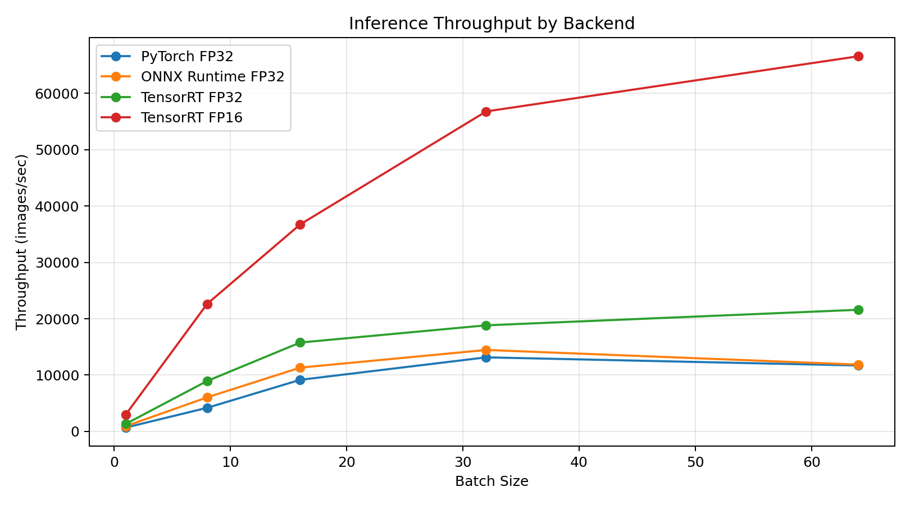
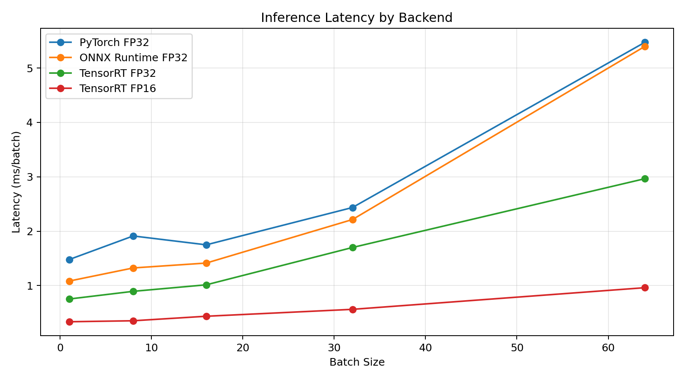

# GPU-Accelerated Image Classification Inference System

A compact end-to-end image classification inference project that starts from a trained PyTorch model, exports it to ONNX, optimizes it with TensorRT, benchmarks multiple GPU inference backends, and exposes the model through a FastAPI prediction server.

The goal of this project is not only to train a CIFAR-10 classifier, but to show the full deployment path from model checkpoint to low-latency GPU inference service.

## Highlights

- Trained a ResNet18-based CIFAR-10 classifier with PyTorch.
- Exported the model to ONNX with dynamic batch support.
- Benchmarked PyTorch, ONNX Runtime CUDA, TensorRT FP32, and TensorRT FP16.
- Built a FastAPI `/predict` endpoint for image upload and backend selection.
- Achieved **66,591.76 images/sec** with TensorRT FP16 at batch size 64.
- TensorRT FP16 reached **5.69x higher throughput** than the PyTorch FP32 baseline at batch size 64.

## Tech Stack

- Python
- PyTorch / TorchVision
- ONNX / ONNX Runtime
- NVIDIA TensorRT
- CUDA
- FastAPI
- CIFAR-10

## Project Structure

```text
gpu-image-inference/
├── src/
│   ├── data.py                  # CIFAR-10 dataloaders and transforms
│   ├── model.py                 # ResNet18 model definition and checkpoint loading
│   ├── train.py                 # PyTorch training script
│   ├── export_onnx.py           # Export FP32 ONNX model
│   ├── export_onnx_fp16.py      # Export FP16 ONNX model
│   ├── benchmark_pytorch.py     # PyTorch FP32 benchmark
│   ├── benchmark_onnx.py        # ONNX Runtime CUDA benchmark
│   ├── benchmark_tensorrt.py    # TensorRT FP32 / FP16 benchmark
│   └── server_fastapi.py        # FastAPI inference server
├── models/                      # Model checkpoints and exported engines
├── results/                     # Benchmark CSV outputs
└── README.md
```

## Model

The model is based on ResNet18 and modified for CIFAR-10:

- First convolution changed to `3x3`, stride `1`, padding `1`.
- Initial max pooling removed.
- Final classifier changed to output 10 CIFAR-10 classes.

Input shape:

```text
[B, 3, 32, 32]
```

Classes:

```text
airplane, automobile, bird, cat, deer, dog, frog, horse, ship, truck
```

## Workflow

```text
Train PyTorch model
        ↓
Save checkpoint
        ↓
Export to ONNX
        ↓
Build TensorRT engines
        ↓
Benchmark inference backends
        ↓
Serve prediction API with FastAPI
```

## Environment

Test machine:

```text
GPU: NVIDIA GeForce RTX 5080 Laptop GPU
Input: CIFAR-10 image, 3 x 32 x 32
Batch sizes: 1, 8, 16, 32, 64
Warmup iterations: 20
Benchmark iterations: 500
```

## Training

```bash
python src/train.py
```

The training script saves the best checkpoint to:

```text
models/resnet_cifar10.pth
```

## Export ONNX

Export FP32 ONNX:

```bash
python src/export_onnx.py
```

Export FP16 ONNX:

```bash
python src/export_onnx_fp16.py
```

The ONNX export uses named inputs and outputs:

```text
input:  input
output: output
```

The batch dimension is dynamic, so the exported model supports multiple batch sizes during inference.

## Benchmark

Run all benchmark scripts:

```bash
python src/benchmark_pytorch.py --repeats 500
python src/benchmark_onnx.py --repeats 500
python src/benchmark_tensorrt.py --load_path models/resnet_cifar10_fp32.trt --repeats 500
python src/benchmark_tensorrt.py --load_path models/resnet_cifar10_fp16.trt --repeats 500
```

Benchmark results are saved under:

```text
results/
```

Example output files:

```text
results/benchmark_pytorch_fp32.csv
results/benchmark_onnx_fp32.csv
results/benchmark_tensorrt_fp32.csv
results/benchmark_tensorrt_fp16.csv
```

## Results

### Throughput



### Latency



### Full Benchmark Table

| Backend | Precision | Batch Size | Latency(ms/batch) | Throughput(img/s) |
|---|---|---:|---:|---:|
| PyTorch | FP32 | 1 | 1.479 | 676.23 |
| PyTorch | FP32 | 8 | 1.912 | 4,184.04 |
| PyTorch | FP32 | 16 | 1.749 | 9,149.17 |
| PyTorch | FP32 | 32 | 2.435 | 13,142.89 |
| PyTorch | FP32 | 64 | 5.472 | 11,696.24 |
| ONNX Runtime | FP32 | 1 | 1.083 | 923.17 |
| ONNX Runtime | FP32 | 8 | 1.324 | 6,040.54 |
| ONNX Runtime | FP32 | 16 | 1.414 | 11,317.66 |
| ONNX Runtime | FP32 | 32 | 2.214 | 14,455.63 |
| ONNX Runtime | FP32 | 64 | 5.397 | 11,858.43 |
| TensorRT | FP32 | 1 | 0.753 | 1,328.63 |
| TensorRT | FP32 | 8 | 0.894 | 8,945.17 |
| TensorRT | FP32 | 16 | 1.014 | 15,772.58 |
| TensorRT | FP32 | 32 | 1.700 | 18,829.04 |
| TensorRT | FP32 | 64 | 2.965 | 21,586.65 |
| TensorRT | FP16 | 1 | 0.335 | 2,984.57 |
| TensorRT | FP16 | 8 | 0.353 | 22,634.89 |
| TensorRT | FP16 | 16 | 0.436 | 36,734.79 |
| TensorRT | FP16 | 32 | 0.563 | 56,801.66 |
| TensorRT | FP16 | 64 | 0.961 | 66,591.76 |

## Key Findings

At batch size 64:

| Backend | Precision | Throughput(img/s) | Speedup vs PyTorch FP32 |
|---|---|---:|---:|
| PyTorch | FP32 | 11,696.24 | 1.00x |
| ONNX Runtime | FP32 | 11,858.43 | 1.01x |
| TensorRT | FP32 | 21,586.65 | 1.85x |
| TensorRT | FP16 | 66,591.76 | 5.69x |

TensorRT FP16 is the fastest backend in this benchmark. It significantly reduces latency and improves throughput by using TensorRT engine optimization and half-precision GPU execution.

One important detail is that the ONNX Runtime benchmark uses `session.run()` with NumPy inputs. This path may include CPU-GPU transfer overhead. The TensorRT benchmark uses GPU tensors directly as input and output buffers, which better reflects optimized deployment-style inference.

## FastAPI Inference Server

Start the server:

```bash
uvicorn src.server_fastapi:app --host 0.0.0.0 --port 8000
```

Health check:

```bash
curl http://localhost:8000/health
```

Run PyTorch inference:

```bash
curl -X POST "http://localhost:8000/predict?backend=pytorch" \
  -F "file=@example.png"
```

Run TensorRT inference:

```bash
curl -X POST "http://localhost:8000/predict?backend=tensorrt" \
  -F "file=@example.png"
```

Example response:

```json
{
  "class": "airplane"
}
```

## What This Project Demonstrates

This project demonstrates practical ML systems skills beyond model training:

- Building a reproducible PyTorch training pipeline.
- Exporting models from PyTorch to ONNX.
- Validating numerical correctness between PyTorch and ONNX Runtime.
- Running controlled GPU inference benchmarks.
- Comparing latency and throughput across batch sizes.
- Using TensorRT FP32 and FP16 engines for inference acceleration.
- Serving a GPU model through a FastAPI endpoint.

## Limitations and Future Improvements

- Add confidence score and latency measurement to the FastAPI response.
- Replace hard-coded local model paths in the server with CLI arguments or environment variables.
- Add a script to automatically build TensorRT engines from ONNX files.
- Add ONNX Runtime I/O binding to reduce CPU-GPU copy overhead.
- Add Docker support for easier deployment.
- Add Triton Inference Server as a production-style serving backend.

## Recruiter-Friendly Summary

Built an end-to-end GPU image inference system for CIFAR-10 classification. The project trains a ResNet18 model in PyTorch, exports it to ONNX, optimizes inference with TensorRT FP32/FP16, benchmarks latency and throughput across batch sizes, and serves predictions through FastAPI. TensorRT FP16 achieved **66.6K images/sec** and **5.69x throughput speedup** over the PyTorch FP32 baseline at batch size 64 on an RTX 5080 Laptop GPU.
